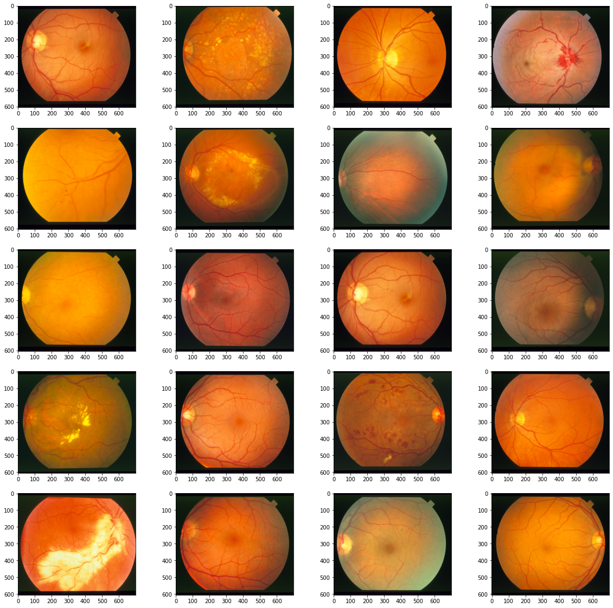
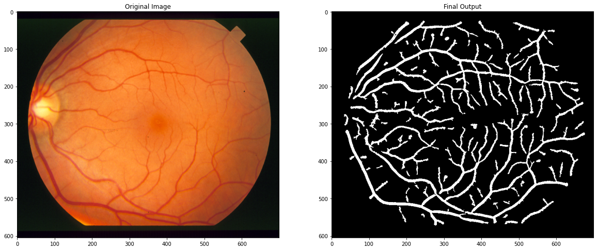
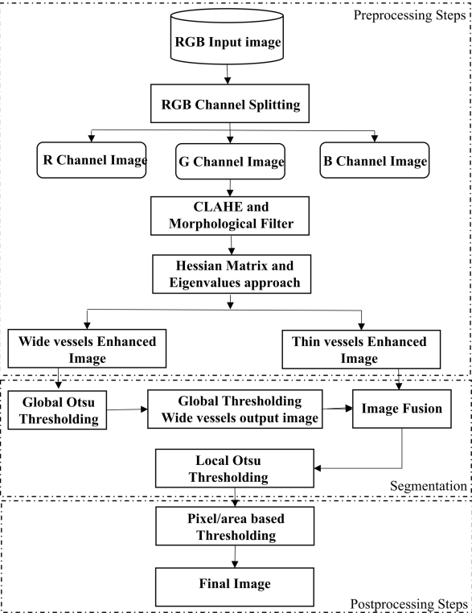
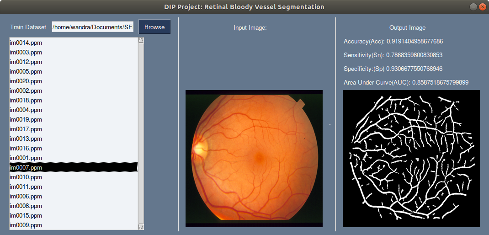
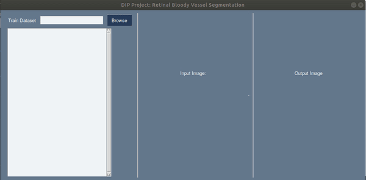

#  A Morphological Hessian Based Approach for Retinal Blood Vessels Segmentation and Denoising Using Region-Based Otsu Thresholding
##  TEAM MEMBERS:

- Aravind Narayanan - 2019102014

- Abhayram A Nair  - 2019102017

- Hemant Suresh - 2019102017

- Prayushi Mathur - 2021701034

#  Goal of the project:

The goal of this project is detection of retinal vasculature by using a morphological hessian-based approach and region-based Otsu thresholding.

#  Setting up the code:
#### Install the requirements
```  
pip3 install -r requirements.txt
```
#### To view the step-by-step functioning of the segmenation:
  
View : [RetinalSegmentation.ipynb](https://github.com/Digital-Image-Processing-IIITH/dip-project-society/blob/main/RetinalSegmentation.ipynb "RetinalSegmentation.ipynb")
#### To open the GUI
```  
python3 script.py
```

#  Repository Structure
#### Folders:
All the data required are present in the repository, however if required they can be downloaded from here as well [DATA](https://iiitaphyd-my.sharepoint.com/personal/abhayram_a_students_iiit_ac_in/_layouts/15/onedrive.aspx?id=%2Fpersonal%2Fabhayram%5Fa%5Fstudents%5Fiiit%5Fac%5Fin%2FDocuments%2FDIP%20Project "DATA")
1. [dataset](https://github.com/Digital-Image-Processing-IIITH/dip-project-society/tree/main/dataset "dataset"): 20 input images used for testing the code
2. [results](https://github.com/Digital-Image-Processing-IIITH/dip-project-society/tree/main/results "results"): 20 output images of the respeciive inputs
3. [testing/labels-ah](https://github.com/Digital-Image-Processing-IIITH/dip-project-society/tree/main/testing/labels-ah "This path skips through empty directories") : 20 ground truth images used for performance analysis
4. resource: contains images used for readme file
5. requirements.txt: Contains list of dependencies(extra dependencies needed to view in jupyter lab are also added)
6. retinalSeg.py: python script version of entire algorithm
7. script.py: GUI implementation
8. RetinalSegmenation.ipynb: Jupyter notebook implementation of algorithm

Link to [presentation](https://github.com/Digital-Image-Processing-IIITH/dip-project-society/blob/main/DIP%20PROJECT%20-%20Society.pptx "presentation"). Link to [presentation pdf](https://github.com/Digital-Image-Processing-IIITH/dip-project-society/blob/main/DIP%20PROJECT%20-%20Society.pdf "presentation pdf")
# Dataset
The input and ground truth images are obtained from the STARE database of following link: [Link](https://cecas.clemson.edu/~ahoover/stare/)
The entire unedited dataset obtained from STARE database can be viewed: 
NOTE: We use the 20 images that are labelled to do the comparison analysis

# Sample Inputs:


Rest of the input images used in repo can be found here: [Input](https://github.com/Digital-Image-Processing-IIITH/dip-project-society/tree/main/dataset "dataset")

Ground truth images: [GroundTruth](https://github.com/Digital-Image-Processing-IIITH/dip-project-society/tree/main/testing/labels-ah "labels-ah")


#  Sample Output




Rest of the output images can be found here: [Results](https://github.com/Digital-Image-Processing-IIITH/dip-project-society/tree/main/results "results")

# Algorithm: 

#  View output using graphical User Interface

1. First run the following commmand:
```  
python3 script.py
```
2. Click on 'browse' button and go into the dataset folder and click 'open'.
3. The list of images would then appear on the left side of the GUI.
4. Then click on any image and wait for a few seconds to see the performance values and the output image.



# Demo

<!-- blank line -->

# View Step by step implementation
The step by step implementation of the code can be viewed on the jupyter notebook named <b>RetinalSegmentation.Ipynb</b> linked here: [Link](https://github.com/Digital-Image-Processing-IIITH/dip-project-society/tree/main/RetinalSegmentation.ipynb "RetinalSegmentation.ipynb")

